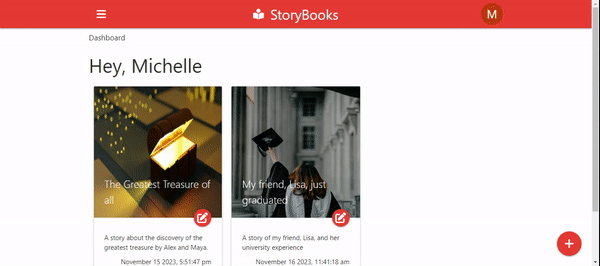

# StoryBooks
A web application that allows users to share private and public stories



[View Demo](https://storybooksapp.onrender.com/)

## Features
- Users can login using Google
- Users can create stories and save as drafts.
- Users can publish stories publicly and they can be viewed on the dashboard.
- Users can publish stories privately.
- Users can favorite stories.

## Tech Stack
- Node
- Express
- Express Handlebars
- Passport for Google Auth
- MongoDB and Mongoose
- Materialize CSS

## Installation Guide
1. Create a directory for the project
```
mkdir my-project
cd my-project
```
2. Get the files by downloading the .zip file or cloning the repository by:
```
git clone https://github.com/MuthoniMN/story_books_app.git
```
3. Create a MongoDB database on [MongoDB Atlas](https://www.mongodb.com/)
4.  Create a 0AUTH 2.0 Client ID on [Google Cloud Console](https://console.cloud.google.com/)
5. Create a .env file for your local environment variables
```
PORT=
MONGO_URI=
GOOGLE_CLIENT_SECRET=
GOOGLE_CLIENT_ID=
```
6. Run the app
```
npm run dev
```

## What I Learnt
1. How to add Google Authentication using Passport
2. Express Handlebars
3. How to use Express global variables
4. How to save images
5. Mongoose features - linking 2 models

For more information, you can check out [Learning Outcomes](LEARNING_HIGHLIGHTS.md)

## Improvements
- [ ]  Adding Social Media Authentication
- [ ]  Adding Local login
- [ ]  Social Sharing
- [ ]  Favorites
- [ ]  Drafts Section
